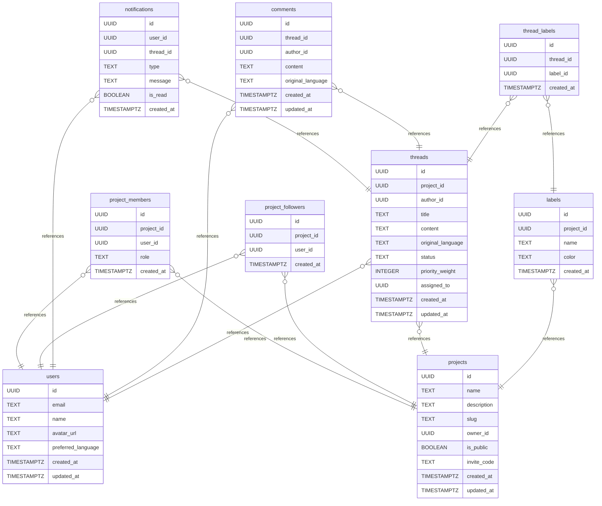

# DB LDM

```mermaid
erDiagram
	project_members }o--|| users : references
	project_members }o--|| projects : references
	project_followers }o--|| users : references
	project_followers }o--|| projects : references
	notifications }o--|| users : references
	notifications }o--|| threads : references
	threads }o--|| projects : references
	comments }o--|| threads : references
	comments }o--|| users : references
	thread_labels }o--|| threads : references
	thread_labels }o--|| labels : references
	labels }o--|| projects : references
	threads }o--|| users : references

	users {
		UUID id
		TEXT email
		TEXT name
		TEXT avatar_url
		TEXT preferred_language
		TIMESTAMPTZ created_at
		TIMESTAMPTZ updated_at
	}

	projects {
		UUID id
		TEXT name
		TEXT description
		TEXT slug
		UUID owner_id
		BOOLEAN is_public
		TEXT invite_code
		TIMESTAMPTZ created_at
		TIMESTAMPTZ updated_at
	}

	project_members {
		UUID id
		UUID project_id
		UUID user_id
		TEXT role
		TIMESTAMPTZ created_at
	}

	project_followers {
		UUID id
		UUID project_id
		UUID user_id
		TIMESTAMPTZ created_at
	}

	threads {
		UUID id
		UUID project_id
		UUID author_id
		TEXT title
		TEXT content
		TEXT original_language
		TEXT status
		INTEGER priority_weight
		UUID assigned_to
		TIMESTAMPTZ created_at
		TIMESTAMPTZ updated_at
	}

	labels {
		UUID id
		UUID project_id
		TEXT name
		TEXT color
		TIMESTAMPTZ created_at
	}

	thread_labels {
		UUID id
		UUID thread_id
		UUID label_id
		TIMESTAMPTZ created_at
	}

	comments {
		UUID id
		UUID thread_id
		UUID author_id
		TEXT content
		TEXT original_language
		TIMESTAMPTZ created_at
		TIMESTAMPTZ updated_at
	}

	notifications {
		UUID id
		UUID user_id
		UUID thread_id
		TEXT type
		TEXT message
		BOOLEAN is_read
		TIMESTAMPTZ created_at
	}
```
