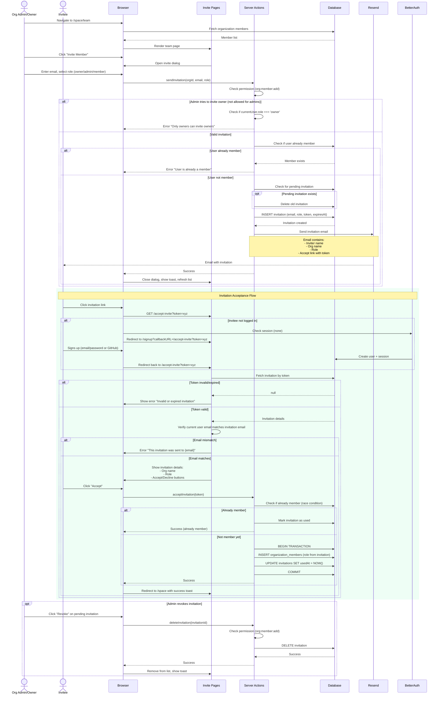
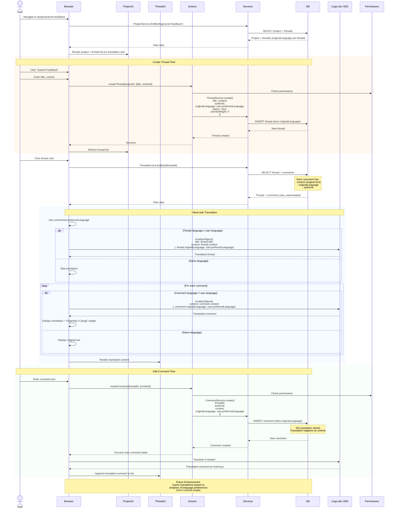

# Database Schema (LDM)

```mermaid
erDiagram
    organizations ||--o{ organization_members : "has"
    organizations ||--o{ projects : "owns"
    users ||--o{ organization_members : "joins"
    users ||--o{ project_members : "contributes_to"
    users ||--o{ project_followers : "follows"
    users ||--o{ threads : "creates"
    users ||--o{ comments : "writes"
    users ||--o{ notifications : "receives"
    projects ||--o{ project_members : "has_contributors"
    projects ||--o{ project_followers : "followed_by"
    projects ||--o{ threads : "contains"
    projects ||--o{ labels : "has"
    threads ||--o{ comments : "has"
    threads ||--o{ thread_labels : "tagged_with"
    threads ||--o{ notifications : "triggers"
    labels ||--o{ thread_labels : "applied_to"
    users ||--o{ threads : "assigned_to"

    organizations {
        UUID id PK
        TEXT name
        TEXT slug UK
        TEXT avatar_url
        TIMESTAMPTZ created_at
        TIMESTAMPTZ updated_at
    }

    organization_members {
        UUID id PK
        UUID organization_id FK
        UUID user_id FK
        TEXT role
        TIMESTAMPTZ created_at
    }

    users {
        UUID id PK
        TEXT email UK
        TEXT name
        TEXT avatar_url
        TEXT preferred_language
        TIMESTAMPTZ created_at
        TIMESTAMPTZ updated_at
    }

    projects {
        UUID id PK
        UUID organization_id FK
        TEXT name
        TEXT description
        TEXT slug
        BOOLEAN is_public
        TEXT invite_code UK
        TIMESTAMPTZ created_at
        TIMESTAMPTZ updated_at
    }

    project_members {
        UUID id PK
        UUID project_id FK
        UUID user_id FK
        TEXT role
        TIMESTAMPTZ created_at
    }

    project_followers {
        UUID id PK
        UUID project_id FK
        UUID user_id FK
        TIMESTAMPTZ created_at
    }

    threads {
        UUID id PK
        UUID project_id FK
        UUID author_id FK
        TEXT title
        TEXT content
        TEXT original_language
        TEXT status
        INTEGER priority_weight
        UUID assigned_to FK
        TIMESTAMPTZ created_at
        TIMESTAMPTZ updated_at
    }

    labels {
        UUID id PK
        UUID project_id FK
        TEXT name
        TEXT color
        TIMESTAMPTZ created_at
    }

    thread_labels {
        UUID id PK
        UUID thread_id FK
        UUID label_id FK
        TIMESTAMPTZ created_at
    }

    comments {
        UUID id PK
        UUID thread_id FK
        UUID author_id FK
        TEXT content
        TEXT original_language
        TIMESTAMPTZ created_at
        TIMESTAMPTZ updated_at
    }

    notifications {
        UUID id PK
        UUID user_id FK
        UUID thread_id FK
        TEXT type
        TEXT message
        BOOLEAN is_read
        TIMESTAMPTZ created_at
    }
```

# Sequence Diagrams

## Authentication and Onboarding Flow

```mermaid
sequenceDiagram
    actor User
    participant Browser
    participant Proxy as Proxy Middleware
    participant AuthUI as Auth Pages
    participant BetterAuth
    participant DB as Database
    participant Resend
    participant OnboardingUI as Onboarding Pages

    alt Email/Password Signup
        User->>Browser: Navigate to /signup
        Browser->>Proxy: GET /signup
        Proxy->>Proxy: Check session (none)
        Proxy->>AuthUI: Allow access
        AuthUI->>Browser: Render signup form

        User->>Browser: Submit email, password, name
        Browser->>BetterAuth: POST /api/auth/sign-up/email
        BetterAuth->>DB: Create user (emailVerified=false)
        BetterAuth->>Resend: Send verification email
        Resend-->>User: Email with verification link
        BetterAuth->>Browser: Success (no session yet)
        Browser->>AuthUI: Show "Check your email" message

        User->>User: Opens email client
        User->>Browser: Click verification link
        Browser->>BetterAuth: GET /api/auth/verify-email?token=xyz
        BetterAuth->>DB: Update user.emailVerified = true
        BetterAuth->>DB: Create session
        BetterAuth->>Browser: Set session cookie + redirect /onboarding

        Browser->>Proxy: GET /onboarding
        Proxy->>Proxy: Check session (exists)
        Proxy->>OnboardingUI: Allow access

        rect rgba(200, 220, 250, 0.3)
            Note over User,OnboardingUI: Onboarding Flow
            OnboardingUI->>Browser: Step 1: Welcome
            User->>Browser: Click "Next"

            OnboardingUI->>Browser: Step 2: Create Organization (optional)
            alt User creates organization
                User->>Browser: Enter org name, slug
                Browser->>DB: createOrganization(name, slug, ownerId)
                DB->>DB: INSERT organization
                DB->>DB: INSERT organization_members (role=owner)
                DB-->>Browser: Success
                OnboardingUI->>Browser: Step 3: Set language
            else User skips
                OnboardingUI->>Browser: Step 3: Set language
            end

            User->>Browser: Select preferred language
            Browser->>DB: UPDATE users SET preferredLanguage
            DB-->>Browser: Success
            OnboardingUI->>Browser: Redirect to /projects
        end
    else GitHub OAuth Signup
        User->>Browser: Navigate to /signup
        Browser->>AuthUI: Render signup page
        User->>Browser: Click "Continue with GitHub"
        Browser->>BetterAuth: GET /api/auth/sign-in/social/github
        BetterAuth->>Browser: Redirect to GitHub

        Browser->>GitHub: Authorization request
        User->>GitHub: Approve access
        GitHub->>Browser: Redirect with code
        Browser->>BetterAuth: GET /api/auth/callback/github?code=...

        BetterAuth->>GitHub: Exchange code for token
        GitHub-->>BetterAuth: Access token + user data
        BetterAuth->>DB: Find or create user (emailVerified=true)
        BetterAuth->>DB: Create session
        BetterAuth->>Browser: Set session cookie + redirect /onboarding

        Browser->>OnboardingUI: Same onboarding flow as above
    end

    alt Login (Email/Password)
        User->>Browser: Navigate to /login
        Browser->>AuthUI: Render login form
        User->>Browser: Submit email, password
        Browser->>BetterAuth: POST /api/auth/sign-in/email

        alt Email not verified
            BetterAuth->>DB: Check user.emailVerified
            BetterAuth->>Browser: 403 Error (email not verified)
            AuthUI->>Browser: Show error + "Resend verification" button
            opt User clicks resend
                Browser->>BetterAuth: POST /api/auth/send-verification-email
                BetterAuth->>Resend: Send verification email
                Resend-->>User: Email with link
            end
        else Email verified
            BetterAuth->>DB: Verify credentials
            BetterAuth->>DB: Create session
            BetterAuth->>Browser: Set session cookie + redirect /projects
        end
    end

    alt Forgot Password
        User->>Browser: Navigate to /forgot-password
        User->>Browser: Enter email
        Browser->>BetterAuth: POST /api/auth/request-password-reset
        BetterAuth->>DB: Find user by email
        BetterAuth->>Resend: Send reset email with token
        Resend-->>User: Email with reset link
        BetterAuth->>Browser: Show "Check your email"

        User->>Browser: Click reset link
        Browser->>BetterAuth: GET /reset-password?token=xyz
        BetterAuth->>Browser: Render reset password form
        User->>Browser: Enter new password
        Browser->>BetterAuth: POST /api/auth/reset-password
        BetterAuth->>DB: Update password hash
        BetterAuth->>Browser: Redirect to /login with success message
    end
```

## Invitation Flow

```mermaid
sequenceDiagram
    actor Admin as Org Admin/Owner
    actor Invitee
    participant Browser
    participant InviteUI as Invite Pages
    participant Actions as Server Actions
    participant DB as Database
    participant Resend
    participant BetterAuth

    Admin->>Browser: Navigate to /space/team
    Browser->>DB: Fetch organization members
    DB-->>Browser: Member list
    Browser->>InviteUI: Render team page

    Admin->>Browser: Click "Invite Member"
    InviteUI->>Browser: Open invite dialog

    Admin->>Browser: Enter email, select role (owner/admin/member)
    Browser->>Actions: sendInvitation(orgId, email, role)

    Actions->>Actions: Check permission (org:member:add)

    alt Admin tries to invite owner (not allowed for admins)
        Actions->>Actions: Check if currentUser.role === 'owner'
        Actions-->>Browser: Error "Only owners can invite owners"
    else Valid invitation
        Actions->>DB: Check if user already member

        alt User already member
            DB-->>Actions: Member exists
            Actions-->>Browser: Error "User is already a member"
        else User not member
            Actions->>DB: Check for pending invitation

            opt Pending invitation exists
                Actions->>DB: Delete old invitation
            end

            Actions->>DB: INSERT invitation (email, role, token, expiresAt)
            DB-->>Actions: Invitation created

            Actions->>Resend: Send invitation email
            Note over Actions,Resend: Email contains:<br/>- Inviter name<br/>- Org name<br/>- Role<br/>- Accept link with token
            Resend-->>Invitee: Email with invitation

            Actions-->>Browser: Success
            Browser->>InviteUI: Close dialog, show toast, refresh list
        end
    end

    rect rgba(200, 250, 220,0.3)
        Note over Invitee,BetterAuth: Invitation Acceptance Flow

        Invitee->>Browser: Click invitation link
        Browser->>InviteUI: GET /accept-invite?token=xyz

        alt Invitee not logged in
            Browser->>BetterAuth: Check session (none)
            Browser->>InviteUI: Redirect to /signup?callbackURL=/accept-invite?token=xyz
            Invitee->>Browser: Signs up (email/password or GitHub)
            BetterAuth->>DB: Create user + session
            Browser->>InviteUI: Redirect back to /accept-invite?token=xyz
        end

        InviteUI->>DB: Fetch invitation by token

        alt Token invalid/expired
            DB-->>InviteUI: null
            InviteUI->>Browser: Show error "Invalid or expired invitation"
        else Token valid
            DB-->>InviteUI: Invitation details

            InviteUI->>InviteUI: Verify current user email matches invitation email

            alt Email mismatch
                InviteUI->>Browser: Error "This invitation was sent to {email}"
            else Email matches
                InviteUI->>Browser: Show invitation details:<br/>- Org name<br/>- Role<br/>- Accept/Decline buttons

                Invitee->>Browser: Click "Accept"
                Browser->>Actions: acceptInvitation(token)

                Actions->>DB: Check if already member (race condition)

                alt Already member
                    Actions->>DB: Mark invitation as used
                    Actions-->>Browser: Success (already member)
                else Not member yet
                    Actions->>DB: BEGIN TRANSACTION
                    Actions->>DB: INSERT organization_members (role from invitation)
                    Actions->>DB: UPDATE invitations SET usedAt = NOW()
                    Actions->>DB: COMMIT
                    Actions-->>Browser: Success
                end

                Browser->>InviteUI: Redirect to /space with success toast
            end
        end
    end

    opt Admin revokes invitation
        Admin->>Browser: Click "Revoke" on pending invitation
        Browser->>Actions: deleteInvitation(invitationId)
        Actions->>Actions: Check permission (org:member:add)
        Actions->>DB: DELETE invitation
        DB-->>Actions: Success
        Actions-->>Browser: Success
        Browser->>InviteUI: Remove from list, show toast
    end
```

## Thread Creation and Commenting Flow

```mermaid
sequenceDiagram
    actor User
    participant Browser
    participant ProjectUI
    participant ThreadUI
    participant Actions
    participant Services
    participant DB
    participant LingoSDK as Lingo.dev SDK
    participant Permissions

    User->>Browser: Navigate to /projects/acme-feedback
    Browser->>Services: ProjectService.findBySlug('acme-feedback')
    Services->>DB: SELECT project + threads
    DB-->>Services: Project + threads (originalLanguage per thread)
    Services-->>Browser: Raw data
    Browser->>ProjectUI: Render project + thread list (no translation yet)

    rect rgba(250, 230, 200, 0.3)
        Note over User,DB: Create Thread Flow

        User->>Browser: Click "Submit Feedback"
        User->>Browser: Enter title, content
        Browser->>Actions: createThread(projectId, {title, content})

        Actions->>Permissions: Check permissions
        Actions->>Services: ThreadService.create({<br/>  title, content,<br/>  authorId,<br/>  originalLanguage: user.preferredLanguage,<br/>  status: 'new',<br/>  priorityWeight: 0<br/>})

        Services->>DB: INSERT thread (store originalLanguage)
        DB-->>Services: New thread
        Services-->>Actions: Thread created
        Actions-->>Browser: Success
        Browser->>ProjectUI: Refresh thread list
    end

    User->>Browser: Click thread card
    Browser->>Services: ThreadService.findById(threadId)
    Services->>DB: SELECT thread + comments
    Note over DB: Each comment has:<br/>- content (original text)<br/>- originalLanguage<br/>- authorId
    DB-->>Services: Thread + comments (raw, untranslated)
    Services-->>Browser: Raw data

    rect rgba(220, 240, 255, 0.3)
        Note over Browser,LingoSDK: Client-side Translation

        Browser->>Browser: Get currentUser.preferredLanguage

        alt Thread language ≠ user language
            Browser->>LingoSDK: localizeObject({<br/>  title: thread.title,<br/>  content: thread.content<br/>}, thread.originalLanguage, user.preferredLanguage)
            LingoSDK-->>Browser: Translated thread
        else Same language
            Browser->>Browser: Skip translation
        end

        loop For each comment
            alt Comment language ≠ user language
                Browser->>LingoSDK: localizeObject({<br/>  content: comment.content<br/>}, comment.originalLanguage, user.preferredLanguage)
                LingoSDK-->>Browser: Translated comment
                Browser->>Browser: Display translated + "Originally in {lang}" badge
            else Same language
                Browser->>Browser: Display original text
            end
        end

        Browser->>ThreadUI: Render translated content
    end

    rect rgba(230, 250, 230,0.3)
        Note over User,DB: Add Comment Flow

        User->>Browser: Enter comment text
        Browser->>Actions: createComment(threadId, {content})

        Actions->>Permissions: Check permissions
        Actions->>Services: CommentService.create({<br/>  threadId,<br/>  authorId,<br/>  content,<br/>  originalLanguage: user.preferredLanguage<br/>})

        Services->>DB: INSERT comment (store originalLanguage)
        Note over DB: NO translation stored<br/>Translation happens at runtime
        DB-->>Services: New comment
        Services-->>Actions: Comment created
        Actions-->>Browser: Success (raw comment data)

        Browser->>LingoSDK: Translate if needed
        LingoSDK-->>Browser: Translated comment (in-memory)
        Browser->>ThreadUI: Append translated comment to list
    end

    Note over Browser,DB: Future Enhancement:<br/>Cache translations based on<br/>analytics of language preferences<br/>(not in current scope)
```

## Thread Prioritization and Ticketing Flow

```mermaid
sequenceDiagram
    actor Maintainer as Project Maintainer
    actor Admin as Org Admin
    actor Member as Org Member
    participant Browser
    participant ThreadUI as Thread Detail
    participant Actions as Server Actions
    participant Permissions
    participant Services
    participant DB as Database
    participant NotifService as Notification Service

    Maintainer->>Browser: Navigate to /projects/acme-feedback/threads/123
    Browser->>Services: ThreadService.findById(123)
    Services->>DB: SELECT thread with project, author
    DB-->>Services: Thread data
    Services-->>Browser: Thread
    Browser->>ThreadUI: Render thread

    ThreadUI->>Permissions: getUserPermissions(userId, orgId, projectId)
    Permissions->>DB: Check organization_members + project_members
    DB-->>Permissions: User roles
    Permissions->>Permissions: Compute permissions array
    Permissions-->>ThreadUI: Permissions list

    ThreadUI->>Browser: Show/hide controls based on permissions

    rect rgba(255, 230, 230, 0.3)
        Note over Maintainer,NotifService: Change Status Flow

        alt User has thread:status:update permission
            ThreadUI->>Browser: Show status dropdown (enabled)
            Maintainer->>Browser: Change status to "under_review"
            Browser->>Actions: updateThreadStatus(threadId, "under_review")

            Actions->>Permissions: Verify thread:status:update permission

            alt Permission denied
                Permissions-->>Actions: Not allowed
                Actions-->>Browser: Error "Permission denied"
            else Permission granted
                Permissions-->>Actions: Allowed

                Actions->>Services: ThreadService.update(threadId, {status: "under_review"})
                Services->>DB: UPDATE threads SET status = 'under_review'
                DB-->>Services: Updated thread

                Services->>NotifService: Notify thread author + followers
                NotifService->>DB: INSERT notifications (type='status_change')

                Services-->>Actions: Success
                Actions-->>Browser: Success

                Browser->>ThreadUI: Update status badge, show toast
            end
        else User does not have permission
            ThreadUI->>Browser: Show status (read-only, no dropdown)
        end
    end

    rect rgba(230, 255, 230, 0.3)
        Note over Admin,NotifService: Assign Thread Flow

        alt User has thread:assign permission
            ThreadUI->>Browser: Show "Assign to" dropdown (enabled)
            ThreadUI->>Services: ProjectService.getMembers(projectId)
            Services->>DB: SELECT project_members + organization_members
            DB-->>Services: Team member list
            Services-->>Browser: Member list
            Browser->>ThreadUI: Populate dropdown

            Admin->>Browser: Select assignee
            Browser->>Actions: assignThread(threadId, assigneeUserId)

            Actions->>Permissions: Verify thread:assign permission

            alt Permission granted
                Actions->>Services: ThreadService.update(threadId, {assignedTo: userId})
                Services->>DB: UPDATE threads SET assigned_to = userId
                DB-->>Services: Updated thread

                Services->>NotifService: Notify assignee
                NotifService->>DB: INSERT notification (type='assignment')

                Services-->>Actions: Success
                Actions-->>Browser: Success

                Browser->>ThreadUI: Update assignee display, show toast
            else Permission denied
                Actions-->>Browser: Error "Permission denied"
            end
        else User cannot assign
            ThreadUI->>Browser: Show assignee (read-only)
        end
    end

    rect rgba(230, 230, 255, 0.3)
        Note over Admin,NotifService: Set Priority Flow

        alt User has thread:priority:update permission
            ThreadUI->>Browser: Show priority slider (0-10)
            Admin->>Browser: Adjust priority to 8
            Browser->>Actions: updateThreadPriority(threadId, 8)

            Actions->>Permissions: Verify thread:priority:update permission

            alt Permission granted
                Actions->>Services: ThreadService.update(threadId, {priorityWeight: 8})
                Services->>DB: UPDATE threads SET priority_weight = 8
                DB-->>Services: Updated thread

                Services->>NotifService: Notify thread author
                NotifService->>DB: INSERT notification (type='priority_change')

                Services-->>Actions: Success
                Actions-->>Browser: Success

                Browser->>ThreadUI: Update priority display, show toast
            else Permission denied
                Actions-->>Browser: Error "Permission denied"
            end
        else User cannot set priority
            ThreadUI->>Browser: Show priority (read-only badge)
        end
    end

    rect rgba(255, 245, 230, 0.3)
        Note over Admin,NotifService: Label Management Flow

        alt User has label:create permission
            Admin->>Browser: Click "Add Label"
            ThreadUI->>Browser: Show label selector

            opt Create new label
                Admin->>Browser: Click "Create new label"
                Browser->>ThreadUI: Show create label dialog
                Admin->>Browser: Enter name, select color
                Browser->>Actions: createLabel(projectId, {name, color})

                Actions->>Permissions: Verify label:create permission
                Actions->>Services: LabelService.create(projectId, name, color)
                Services->>DB: INSERT label
                DB-->>Services: New label
                Services-->>Actions: Label created
                Actions-->>Browser: Success
            end

            Admin->>Browser: Select label(s)
            Browser->>Actions: addLabelToThread(threadId, labelId)

            Actions->>Permissions: Verify label:create permission
            Actions->>Services: ThreadLabelService.create(threadId, labelId)
            Services->>DB: INSERT thread_labels
            DB-->>Services: Success
            Services-->>Actions: Label added
            Actions-->>Browser: Success

            Browser->>ThreadUI: Show new label badge on thread
        end

        opt Remove label
            Admin->>Browser: Click X on label badge
            Browser->>Actions: removeLabelFromThread(threadId, labelId)
            Actions->>Permissions: Verify permission
            Actions->>Services: ThreadLabelService.delete(threadId, labelId)
            Services->>DB: DELETE thread_labels
            DB-->>Services: Success
            Services-->>Actions: Success
            Actions-->>Browser: Success
            Browser->>ThreadUI: Remove label badge
        end
    end

    rect rgba(240, 240, 240, 0.3)
        Note over Member,NotifService: Follow Thread (for notifications)

        Member->>Browser: Click "Follow" button on thread
        Browser->>Actions: followThread(threadId)

        Actions->>Services: ThreadFollowerService.create(threadId, userId)
        Services->>DB: INSERT thread_followers
        DB-->>Services: Success
        Services-->>Actions: Success
        Actions-->>Browser: Success

        Browser->>ThreadUI: Update button to "Following"

        Note over Member,NotifService: User will now receive notifications<br/>for status changes, comments, etc.
    end

    opt Bulk operations (Admin only)
        Admin->>Browser: Select multiple threads (checkboxes)
        Admin->>Browser: Click "Bulk Actions" → "Change Status"
        Browser->>ThreadUI: Show bulk status dialog
        Admin->>Browser: Select new status
        Browser->>Actions: bulkUpdateStatus(threadIds[], newStatus)

        Actions->>Permissions: Verify thread:status:update permission
        Actions->>Services: Loop through threadIds
        loop For each thread
            Services->>DB: UPDATE threads SET status
            Services->>NotifService: Queue notifications
        end

        Services-->>Actions: All updated
        Actions-->>Browser: Success with count
        Browser->>ThreadUI: Refresh thread list, show toast "5 threads updated"
    end
```
