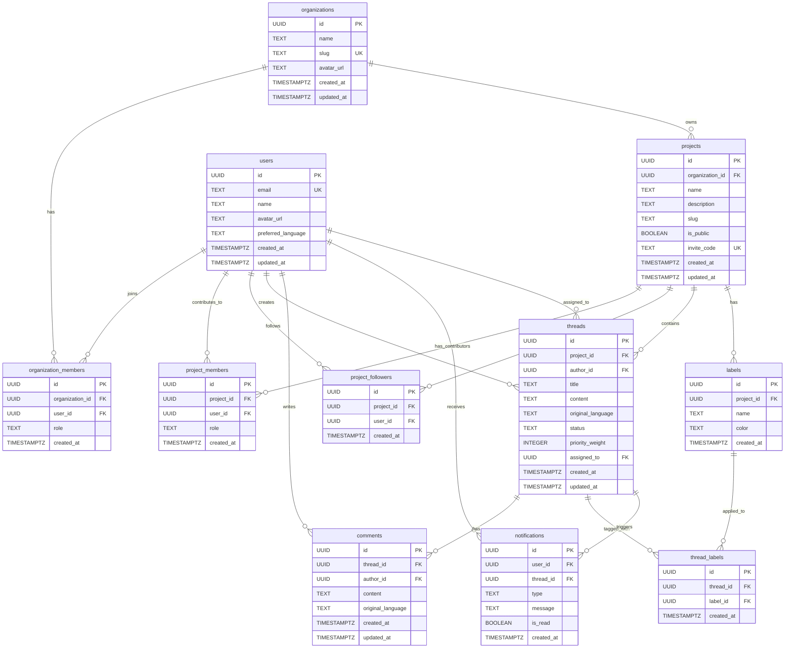

# Database Schema (LDM)

```mermaid
erDiagram
    organizations ||--o{ organization_members : "has"
    organizations ||--o{ projects : "owns"
    users ||--o{ organization_members : "joins"
    users ||--o{ project_members : "contributes_to"
    users ||--o{ project_followers : "follows"
    users ||--o{ threads : "creates"
    users ||--o{ comments : "writes"
    users ||--o{ notifications : "receives"
    projects ||--o{ project_members : "has_contributors"
    projects ||--o{ project_followers : "followed_by"
    projects ||--o{ threads : "contains"
    projects ||--o{ labels : "has"
    threads ||--o{ comments : "has"
    threads ||--o{ thread_labels : "tagged_with"
    threads ||--o{ notifications : "triggers"
    labels ||--o{ thread_labels : "applied_to"
    users ||--o{ threads : "assigned_to"

    organizations {
        UUID id PK
        TEXT name
        TEXT slug UK
        TEXT avatar_url
        TIMESTAMPTZ created_at
        TIMESTAMPTZ updated_at
    }

    organization_members {
        UUID id PK
        UUID organization_id FK
        UUID user_id FK
        TEXT role
        TIMESTAMPTZ created_at
    }

    users {
        UUID id PK
        TEXT email UK
        TEXT name
        TEXT avatar_url
        TEXT preferred_language
        TIMESTAMPTZ created_at
        TIMESTAMPTZ updated_at
    }

    projects {
        UUID id PK
        UUID organization_id FK
        TEXT name
        TEXT description
        TEXT slug
        BOOLEAN is_public
        TEXT invite_code UK
        TIMESTAMPTZ created_at
        TIMESTAMPTZ updated_at
    }

    project_members {
        UUID id PK
        UUID project_id FK
        UUID user_id FK
        TEXT role
        TIMESTAMPTZ created_at
    }

    project_followers {
        UUID id PK
        UUID project_id FK
        UUID user_id FK
        TIMESTAMPTZ created_at
    }

    threads {
        UUID id PK
        UUID project_id FK
        UUID author_id FK
        TEXT title
        TEXT content
        TEXT original_language
        TEXT status
        INTEGER priority_weight
        UUID assigned_to FK
        TIMESTAMPTZ created_at
        TIMESTAMPTZ updated_at
    }

    labels {
        UUID id PK
        UUID project_id FK
        TEXT name
        TEXT color
        TIMESTAMPTZ created_at
    }

    thread_labels {
        UUID id PK
        UUID thread_id FK
        UUID label_id FK
        TIMESTAMPTZ created_at
    }

    comments {
        UUID id PK
        UUID thread_id FK
        UUID author_id FK
        TEXT content
        TEXT original_language
        TIMESTAMPTZ created_at
        TIMESTAMPTZ updated_at
    }

    notifications {
        UUID id PK
        UUID user_id FK
        UUID thread_id FK
        TEXT type
        TEXT message
        BOOLEAN is_read
        TIMESTAMPTZ created_at
    }
```
